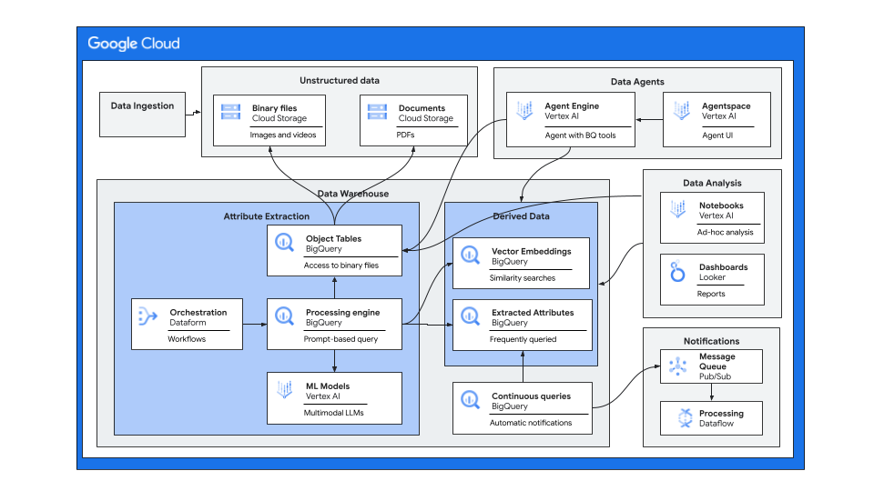
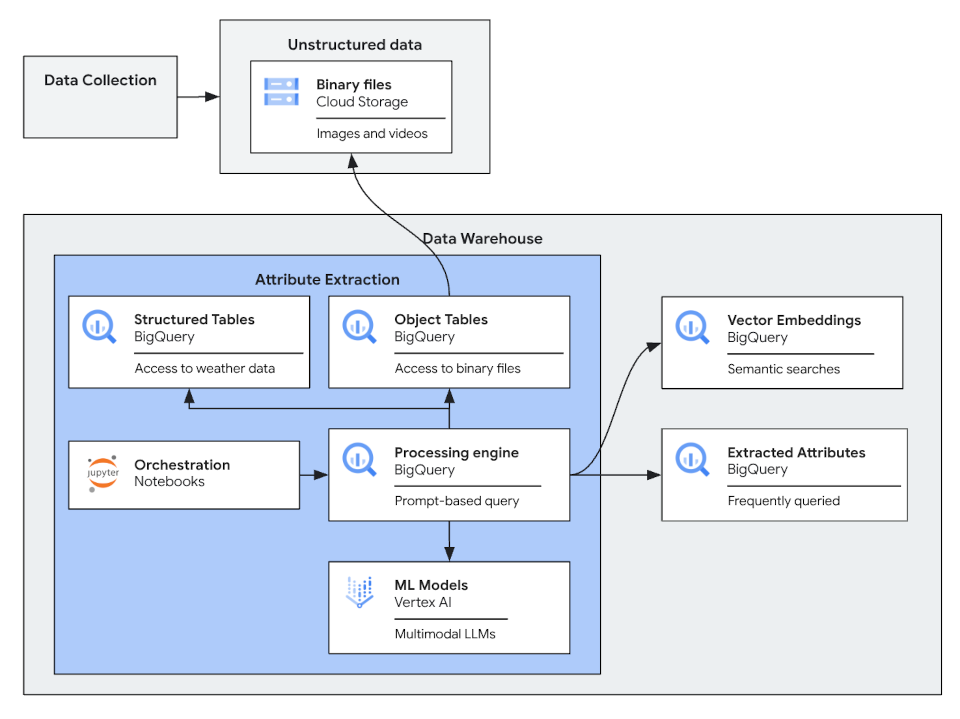

# BigQuery multimodal and semantic search capabilities

[](https://ssh.cloud.google.com/cloudshell/editor?cloudshell_git_repo=GITHUB_URL)

This repo contains a fully functional demo to showcase how BigQuery can do complex processing of images
using multimodal GenAI capabilities of Google Cloud.

## Features

* Ability to automatically make images uploaded to Cloud Storage available for processing via
  BigQuery's SQL
* Ability to extract complex image attributes without the need to train custom models
* Full text search on the automatically generated description of the images
* Vector search for images with similar attributes

## Use Cases

Imagine a large city transportation agency which is trying to improve its passenger satisfaction. The
agency would like to be notified if there are issues with cleanliness and safety of the
bus stops. The city decides to install low cost outdoor facing cameras on its bus fleet and
automatically uploads pictures of their bus stops to a cloud for automatic issue detection. The city
also provides a customer portal to allow uploading bus stop pictures by passengers.

The images should be automatically analyzed and if the bus stop is found to be dirty - an incident
is automatically created. The incident is considered to be resolved if a new image shows the bus stop
to be in acceptable condition. 

The internal users of our transportation agency also needs to perform search and monitoring operations over the physical assets. We will use GenAI capabilities to enable semantic search over the images, helping the system users to discover the information they need using natural language.

In our second use case, we want to make our dataset ready for search and analysis. The transportation agency commercial department want to verify that ads being paid for by our commercial customers are being displayed and that the condition of those bus stops aren't in a pressing need for care. For that, we will enrich our dataset with human and machine friendly information to make it more usable for those queries, where we can find bus stops with specific ads, and understand how many people are standing in those bus stops (impressions of ads) and generate reports for the condition of those bus stops.

Our third use case, we are asked to generate estimations of number of passengers in our bus stops, in order to be better prepared for any large spikes or save costs when we predict lower number of passengers. We will use our input data to project estimations about expected number of riders, using weather data to estimate how number of passengers might change, given weather predictions. 


## Implementation

The code in this repo shows how images uploaded to Google Cloud Storage buckets can be
automatically analyzed without the need to build custom AI/ML models. Only simple and
intuitive Gemini prompts and SQL code are needed to create a fully functional, scalable and secure
implementation of a non-trivial image analysis. Additionally, it shows how vector and full-text
search capabilities of BigQuery can be used to implement semantic search of images.

The following is a high level architecture diagram of the solution:


There are two implementations of the solution. One uses a Vertex AI Notebook to show the
step-by-step implementation of the solution and uses a set of test images to illustrate the actual image
processing. The other implementation is a set of Terraform scripts that automatically creates a
fully functional deployment of the solution.

Currently, the two implementations create two independent BigQuery datasets and Cloud Storage
buckets. This is done to be able to run the implementations independently of each other.

## Getting Started with the Notebooks

By using the provided notebooks, you will create the following solution 

The following notebooks are provided:

1. [CleanSight (Part 1): Multimodal Analysis and Search of Bus Stops](./notebooks/part_1_multimodal_analysis_search.ipynb)
This notebook showcases the power of multimodal Gemini models and BigQuery vector search for a real-world image analysis use case. This notebook is
self-sufficient and can be run independently without needing any other components of this repository. 
2. [CleanSight (Part 2): Large-scale multimodal understanding](./notebooks/part_2_large_scale_understanding.ipynb) This notebook is the second part of the CleanSight example application. Whereas Part 1 represents an operational system that ingests and processes bus stop images as they arrive, this notebook focuses on the large-scale AI capabilities available once a large number of images has been collected. This notebook relies on the resources created in the previous (part 1) notebook.
3. [CleanSight (Part 3): Predictions of bus stop related events](./notebooks/part_3_time_series_forecasting.ipynb) This notebook is the third part of the CleanSight example application. In this notebook, we'll explore how advanced time-series predictions can be combined with data produced using multimodal analysis. __Note__ This notebook requires access to the `WeatherNext` dataset. See the notebook for more details.`

You can run the notebooks in a Vertex AI Workbench instance, in Google Colab Enterprise, or directly
in BigQuery Studio. It is assumed that you have a Google Cloud project with permissions to create a Cloud
Storage bucket. The first notebook goes through a short setup, which includes creating a BigQuery dataset,
creating a BigQuery cloud resource connection, and granting the resource connection's service account
the necessary permissions to interact with Vertex AI models and Cloud Storage.

## Getting Started with the Terraform

### Prerequisites

You need to have access to a Google Cloud project with an active billing account.

### Creating infrastructure

1. Clone this repo and switch to the checked out directory
2. Designate or create a project to create all the artifacts
3. Create `infrastructure/project-setup/terraform.tfvars` file with
   the following content:

```text
project_id = "<your project id>"
```
4. Run Terraform scripts which will enable required APIs for this project

```shell
cd infrastructure/project-setup
terraform init 
terraform apply
```

5. Create `infrastructure/terraform/terraform.tfvars` file with
   the following content:

```text
project_id = "<your project id>"
notification_email = "<your email address for incident alert notifications>"
```

There are additional variables that can be provided in that file to further customize the
deployment.
Please check [infrastructure/terraform/variables.tf](infrastructure/terraform/variables.tf) for
detail.

6. Create infrastructure to run the demo:

```shell
cd infrastructure/terraform
terraform init
terraform apply
```

There is a chance you will get an error when creating a Cloud Run function the first time you run
the script. Wait for a few minutes and try again.

You might also get a transient error "Error creating Routine: googleapi: Error 404: Not found: Model ..."  then
a BigQuery model creation failed (due to a transient error related to a service account's permissions).
Run this script to force re-running the SQL statements which create the models:

```shell
./force-rerunning-model-creation-scripts.sh 
terraform apply
```

## Created infrastructure artifacts

After the Terraform scripts successfully complete, the following artifacts are created in your
project:

* `<project-id>_-bus-stop-images` Cloud Storage bucket
* `bus_stop_image_processing` BigQuery dataset containing:
    * `images` object table, pointing to the Cloud Storage bucket
    * `image_reports` table, containing the results of the image analysis
    * `incidents` table, containing the automatically detected bus stops requiring attention
    * `text_embeddings` table with text embeddings of the textual descriptions of the images
    * `multimodal_embeddings` table with multimodal embeddings of the images themselves
    * several tables with `_watermark` at the name suffix, which are used to track processing state
    * `process_images` stored procedure
    * `update_incidents` stored procedure
    * `semantic_search_text_embeddings` table valued function returning vector search results from text embeddings base table
    * `semantic_search_multimodal_embeddings` table valued function returning vector search results from image embeddings base table
    * `default_model`, `pro_model`, `multimodal_embedding_model` and `text_embedding_model`, which
      refer to different Vertex AI foundational models
* `image-processing-invoker` Cloud Run function to run both `process_images` and `update_incidents`
  stored procedures
* `run_bus_stop_image_processing` Cloud Schedule to run the invoker function
* `data-processor-sa` service account as the principal used by the invoker function

## Processing images using multimodal LLMs
There are two stored procedures which contain the logic of processing images.

[`process_images`](/infrastructure/terraform/bigquery-routines/process-images.sql.tftpl) processes
new images uploaded since the last time this procedure was run. It extracts several attributes 
from the image (e.g., cleanliness level, number of people) and the generic image description 
using a Vertex AI multimodal LLM. The result of processing is stored in the `image_reports` table. 
The description's text embedding is generated using a Vertex AI's text embedding LLM and stored 
in the `text_embeddings` table. The procedure expects all the files to contain "stop_id" metadata 
attribute.

[`update_incidents`](/infrastructure/terraform/bigquery-routines/update-incidents-procedure.sql.tftpl)
looks for newly processed images and creates new records in `incidents` tables in case the bus stop
cleanliness level is low and there is no active incident. If the bus stop appears clean, it updates
the current incident to automatically "close" it.

You can run each procedure independent of each other.

### Enabling automatic processing

The invoker Cloud Function is scheduled to run every 3 minutes using Cloud Scheduler. It runs
`process_images` and `update_incidents` in succession. This function simulates end-to-end processing
of uploaded files.

By default, the schedule is disabled. To process new images automatically, navigate
to [Cloud Scheduler](https://console.cloud.google.com/cloudscheduler).
in Google Cloud Console and enable `run_bus_stop_image_processing` schedule.

Notice, that if you re-run `terraform apply` it will disable the schedule again. You can permanently
enable the scheduler by changing the Terraform variable `pause_scheduler` to `false`.

### Uploading test files

`process_images` procedure looks for the files in the `images` "folder" of the bucket. A shell 
script [`copy-image.sh`](/copy-image.sh) in the root directory can be used to copy images to that 
folder. The script takes three parameters - source file (must be a JPEG image), destination object 
name and the id of the bus stop. You can try to take a picture of a bus stop yourself and upload it 
to the bucket to see how the Gemini model is able to analyze it.

There is a test image file generated by Imagen 3 in the [data](data) directory. To simulate
capturing an image of a dirty bus stop, run 

```shell
./copy-image.sh data/bus-stop-1-dirty.jpeg bus-stop-1-dirty.jpeg stop-1
```

There are also several staged real and somewhat altered images of bus stops in various degrees of 
cleanliness. Run:

```shell
./upload-batch.sh data/batch-1.txt 
```

to simulate transmission of bus stop images from several buses. 

You can run `process_images` manually after you uploaded images, or you can let the automated 
processing take care of this. You can the see the progress by examining the contents of `reports` table.
If you run `update_incidents`, the `incidents` table should also be updated if there are bus stops
which need attention.

## Searching and analyzing images
There are multiple ways to search images using BigQuery's SQL. 

### Using extracted attributes
The primary purpose of extracting the attributes like `cleanliness_level` and `is_bus_stop` is to
enable the downstream processing to use very simple and efficient queries to analyze the state of
bus stops. Once extracted, you can easily answer questions like "what is the current number and 
percentage of stops which require attention" or create Looker dashboards to show historic trends
and allow complex filtering and aggregation.

As the number of use cases grows, the prompt that extracts the attributes can be adjusted to extract
additional attributes to be stored in the `reports` table.

There could be a need ad-hoc analysis on the attributes which are not currently extracted. 
The following sections offer different options on how this analysis can be done.

### Full text search

The Terraform scripts created a full text search index on the `description` field of the `reports`
table. This field can be searched directly using
BigQuery's [SEARCH](https://cloud.google.com/bigquery/docs/reference/standard-sql/search_functions#search)
function:

```sql
SELECT *
    FROM `bus_stop_image_processing.image_reports`
    WHERE SEARCH(description, "`broken glass`")
        # Combining text search with filtering on extracted attributes
        AND cleanliness_level < 2
```

Notice that the SEARCH function supports sophisticated search query rules. Here we only showed
a simple search for two adjacent words, "broken" and "glass".

### Semantic search using text embeddings

Semantic search can find matches even when the exact search keywords don't occur in the description.

Function `semantic_search_text_embeddings` accepts a text search string as a parameter to perform
a [VECTOR_SEARCH](https://cloud.google.com/bigquery/docs/reference/standard-sql/search_functions#vector_search)
over the text embeddings of the image descriptions. The function first generates a text embedding of the text search string
using the same embedding model used to create the text embeddings for the image descriptions.

```sql
SELECT *
    FROM `bus_stop_image_processing.semantic_search_text_embeddings`("a bus stop with broken glass")
    ORDER BY distance
```

The current implementation of the function is hardcoded to return top 10 closest matches (records
from `reports` table).

Table results also includes:
- `distance` column, which should be used to gauge how semantically close the matches are. 
- `rank` column which is assigned to each result based on its distance. Closest images get lower ranks (1, 2, 3, etc.).

### Semantic search using multimodal embeddings

[Multimodal embeddings and search](https://cloud.google.com/bigquery/docs/generate-multimodal-embeddings)
is very similar to creating text embeddings and searching them.
The primary difference is the use of image embeddings generated by a multimodal embedding model.

Function `semantic_search_multimodal_embeddings` accepts a text search string as a parameter to perform
a [VECTOR_SEARCH](https://cloud.google.com/bigquery/docs/reference/standard-sql/search_functions#vector_search)
over the image embeddings. The function first generates a text embedding of the text search string
using the same multimodal embedding model used to create the image embeddings.

```sql
SELECT *
    FROM `bus_stop_image_processing.semantic_search_multimodal_embeddings`("a bus stop with broken glass")
    ORDER BY distance
```

Similar to `semantic_search_text_embeddings`, `semantic_search_multimodal_embeddings` includes `distance` and `rank` columns.

Depending on the embedding model used, the vector embeddings will be mapped out differently in the vector space.
Therefore, the vector search results and their respective distances will be different depending on which semantic search function is used. 

The majority of the bus stop image embeddings are in close proximity to each other when the default multimodal
embedding model is used. In that case, vector searches can return a number of images with very similar distance.

### Hybrid search

Combining result sets from different searches is broadly known as hybrid search.
There are different approaches depending on what type of search you're looking to perform.

#### Approach 1: Combining different vector searches

You can search and combine results from different models and vector spaces, in our case the text embeddings and multimodal embeddings. This approach is typically used when combining semantic search results (using dense embeddings) with keyword-based search results (using sparse embeddings generated by a vectorizer like [TF-IDF](https://en.wikipedia.org/wiki/Tf%E2%80%93idf) or [BM25](https://en.wikipedia.org/wiki/Okapi_BM25)).

For our purposes, we'll just combine the search results from the two deployed embedding models used `text_embedding_model` and `multimodal_embedding_model`, but the same approach applies with other pre-trained or custom embedding models.

To that end, the [Reciprocal Rank Fusion (RRF)](https://cloud.google.com/vertex-ai/docs/vector-search/about-hybrid-search#rrf) algorithm is commonly used to combine results from different ranking methods into a single, unified ranking. It works by giving higher scores to results that appear near the top of multiple result sets.

Here's a simplified SQL implementation of RRF, combining semantic search results of two vector searches `semantic_search_multimodal_embeddings` and `semantic_search_text_embeddings` using the same query "a bus stop with broken glass":

```sql
DECLARE rrf_ranking_alpha DEFAULT 0.5;

WITH ranked_results_multimodal_embeddings AS (
  SELECT
    uri, distance, rank
  FROM `bus_stop_image_processing.semantic_search_multimodal_embeddings`("a bus stop with broken glass")
),
     ranked_results_text_embeddings AS (
       SELECT
         uri, distance, rank
       FROM `bus_stop_image_processing.semantic_search_text_embeddings`("a bus stop with broken glass")
     )
-- Calculate RRF scores
SELECT
  -- Use uri from either result set
  COALESCE(r1.uri, r2.uri) AS uri,
  -- Weighted RRF score handling missing ranks
  (rrf_ranking_alpha * COALESCE(1.0 / r1.rank, 0)) +
  ((1-rrf_ranking_alpha) * COALESCE(1.0 / r2.rank, 0)) AS rrf_score,
FROM ranked_results_multimodal_embeddings r1
-- Use OUTER JOIN to include results from both sets
       FULL OUTER JOIN ranked_results_text_embeddings r2 ON r1.uri = r2.uri
-- Sort by RRF score
ORDER BY rrf_score DESC;  
```

The query joins the two results sets based on image `uri`. It then calculates the reciprocal rank for each image in each result set, then calculates final RRF score by taking a weighted average of the scores. The weights are set to 0.5 for each result set, but that can be adjusted using the `rrf_ranking_alpha` variable based on which retrieval system you want to prioritize. The search terms used for each type of search can also be improved based on testing using a realistic set of images.

#### Approach 2: Enhancing vector search results with keyword matches

The [keyword search](#full-text-search) we used above only returns exact matches. It's a deterministic Boolean retrieval model where each image in the result set has all keywords, and in a specific order. In other words, you don't have a distance metric to rank the results.

One approach to combining a keyword search results with semantic search is to boost the results that also match the keywords while still primarily ranking based on semantic similarity. This might be useful when you want to boost a semantic match with an exact keywords match like "broken glass" compared to another semantic match with different keywords "broken cup". This approach blends the precision of Boolean retrieval with the nuanced understanding of semantic retrieval.

Here's a simplified SQL implementation, where keyword matching in treated as binary feature:

```sql
DECLARE boost_factor DEFAULT 0.2;

WITH ranked_results_text_embeddings AS (
  SELECT
    uri, distance, rank
  FROM `bus_stop_image_processing.semantic_search_text_embeddings`("a bus stop with broken glass")
),
     keyword_search_results AS (
       SELECT
         uri, description
       FROM `bus_stop_image_processing.image_reports`
       WHERE SEARCH(description, "`broken glass`")
     )
-- Combine with keyword results and boost keyword matches
SELECT
  r.uri,
  (1.0 / r.rank) AS semantic_score,
  -- Binary keyword match feature
  CASE WHEN k.uri IS NOT NULL THEN 1 ELSE 0 END AS keyword_match,
  -- Boost score for keyword matches
  (1.0 / r.rank) + (CASE WHEN k.uri IS NOT NULL THEN boost_factor ELSE 0 END) AS boosted_score,
FROM ranked_results_text_embeddings r
-- Use LEFT JOIN to include all semantic vector search results
       LEFT JOIN keyword_search_results k ON r.uri = k.uri
-- Sort by boosted score, then by semantic rank
ORDER BY boosted_score DESC, r.rank ASC;
```

The query joins the two results sets based on image `uri`. It adds a binary `keyword_match` column and boosts the score of semantic matches that also have a match in the keyword results set. You can tune the `boost_factor` variable to control the influence of the boolean match.

Remember to adapt these approaches and the SQL code to your specific needs and data. You can experiment with different methods and ranking parameters to find the best combination for your search application.

### Analyzing the object table directly
If none of the approaches above give good answers, the source object table can be analyzed using
various prompts. 

This approach can be also used when upgrading to the new versions of various models used here. It is
important that the responses produced by the new models will be correctly processed by the SQL 
statements in the [`process_images`](/infrastructure/terraform/bigquery-routines/process-images.sql.tftpl) 
stored procedure.

### Note on using vector indexes
This repo doesn't create [vector indexes](https://cloud.google.com/bigquery/docs/vector-index) automatically. 
Vector indexes can be created only if the table to be indexed contains at least 5,000 records. 
It's highly recommended to add the indexes in production environment to optimize vector search performance.

## Cleanup

```shell
terraform -chdir infrastructure/terraform destroy 
```

## Contributing

Contributions to this library are always welcome and highly encouraged.

See [CONTRIBUTING](CONTRIBUTING.md) for more information how to get started.

Please note that this project is released with a Contributor Code of Conduct. By participating in
this project you agree to abide by its terms. See [Code of Conduct](CODE_OF_CONDUCT.md) for more
information.

## License

Apache 2.0 - See [LICENSE](LICENSE) for more information.
