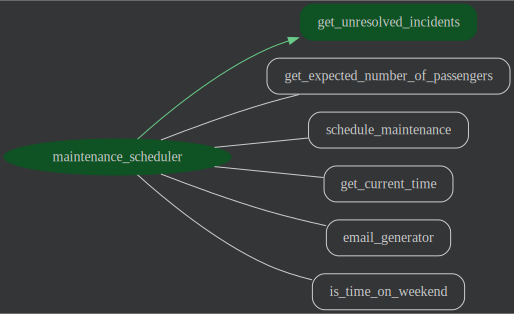

# Bus Stop Maintenance Scheduling Agent

## Overview

This project implements an AI-powered bus stop maintenance scheduling agent. 

## Agent Details

The key features of the scheduling agent include integration with BigQuery and advanced reasoning
capabilities prioritizing scheduling of one bus stop over the other.

### Agent Architecture




### Key Features

[//]: # (TODO: add descriptions)

#### Tools

The agent has access to the following tools:

[//]: # (TODO: add tool descriptions)

## Setup and Installations

### Prerequisites

- Python 3.11+
- Poetry (for dependency management)
- Google ADK SDK (installed via Poetry)
- Google Cloud Project (for Vertex AI Gemini integration)

### Installation
1.  **Prerequisites:**

    For the Agent Engine deployment steps, you will need
    a Google Cloud Project. Once you have created your project,
    [install the Google Cloud SDK](https://cloud.google.com/sdk/docs/install).
    Then run the following command to authenticate with your project:
    ```bash
    gcloud auth login
    ```
    You also need to enable certain APIs. Run the following command to enable
    the required APIs:
    ```bash
    gcloud services enable aiplatform.googleapis.com
    ```

1.  Clone the repository:

    ```bash
    git clone https://github.com/GoogleCloudPlatform/data-to-ai.git
    cd agents/maintenance-scheduler
    ```

    For the rest of this tutorial **ensure you remain in the `agents/maintenance-scheduler` directory**.

2.  Install dependencies using Poetry:

- if you have not installed poetry before then run `pip3 install poetry` first. Then you can create your virtual environment and install all dependencies using:

  ```bash
  poetry install
  ```

  To activate the virtual environment run:

  ```bash
  poetry env activate
  ```

3.  Set up Google Cloud credentials:

    - Ensure you have a Google Cloud project.
    - Make sure you have the Vertex AI API enabled in your project.
    - Set the `GOOGLE_GENAI_USE_VERTEXAI`, `GOOGLE_CLOUD_PROJECT`, and `GOOGLE_CLOUD_LOCATION` environment variables. You can set them in your `.env` file (modify and rename .env_sample file to .env) or directly in your shell. Alternatively you can edit [customer_service/config.py](maintenance_scheduler/config.py)

    ```bash
    export GOOGLE_CLOUD_PROJECT=YOUR_PROJECT_NAME_HERE
    export GOOGLE_GENAI_USE_VERTEXAI=1
    export GOOGLE_CLOUD_LOCATION=us-central1
    ```

## Running the Agent

You can run the agent using the ADK commant in your terminal.
from the root project directory:

1.  Run agent in CLI:

    ```bash
    adk run maintenance_scheduler
    ```

2.  Run agent with ADK Web UI:
    ```bash
    adk web
    ```
    Select the maintenance_scheduler from the dropdown

[//]: # (### Example Interaction - TODO)


## Evaluating the Agent

Evaluation tests assess the overall performance and capabilities of the agent in a holistic manner.

**Steps:**

1.  **Run Evaluation Tests:**

    ```bash
    pytest eval
    ```

    - This command executes all test files within the `eval` directory.

## Unit Tests

Unit tests focus on testing individual units or components of the code in isolation.

**Steps:**

1.  **Run Unit Tests:**

    ```bash
    pytest tests/unit
    ```

    - This command executes all test files within the `tests/unit` directory.

## Configuration

You can find further configuration parameters in [maintenance_scheduler/config.py](maintenance_scheduler/config.py). This includes parameters such as agent name, app name and LLM model used by the agent.

## Deployment on Google Agent Engine

In order to inherit all dependencies of your agent you can build the wheel file of the agent and run the deployment.

1.  **Build Customer Service Agent WHL file**

    ```bash
    poetry build --format=wheel --output=deployment
    ```

1.  **Deploy the agent to agents engine**
    It is important to run deploy.py from withing deployment folder so paths are correct

    ```bash
    cd deployment
    python deploy.py
    ```

### Testing deployment

1.  **Update .env file with the agent id**
    When the deployment is successful, the last line of the output will be: 
    "Agent deployed successfully under resource name: projects/XXX/locations/us-central1/reasoningEngines/YYY"
Copy the resource name and update the environment variable `GOOGLE_AGENT_RESOURCE_ID` in `.env` file.

1.  **Run the test script**

    Use the code in [test_deployed_agent.py](./test_deployed_agent.py) to test how the engine responds.

