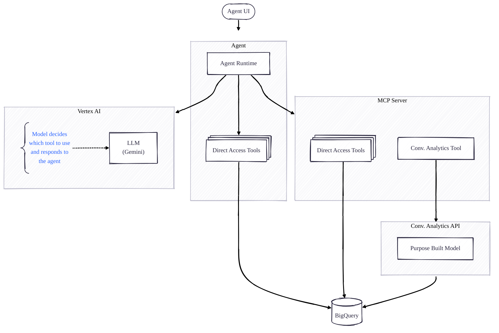

# Instructions on running the ADK and BigQuery lab

## Goals

This lab will show different ways to access data in BigQuery from custom agents built using the open
source Agent Development Kit (ADK).

You will learn how to create custom tools to access BigQuery and how to use an MCP server which
implements a number of pre-built BigQuery tools.

*Note*: ADK is a generic agent framework which allows creating sophisticated agents using
workflows (sequential, parallel or custom sequencing) and parent/child/sibling agent
compositions, offers session and state management and has a number of other features. The best
practices and design patterns of creating complex agents is outside the scope of this lab.

## What does the sample agent look like?

There is a quick overview of how the ADK agent you will use in this lab works:



## Prerequisites

The lab assumes you ran all the code cells the
notebook [genai_in_bigquery.ipynb](./../genai_in_bigquery.ipynb).
The following BigQuery objects should be created:

* `multimodal` BigQuery dataset with three tables:
    * `objects` - object table pointing to a small set of images
    * `image_reports` - outcome of the LLM processing of these images
    * `image_reports_vector_db` - text embeddings of the descriptions of the images

You should have sufficient permissions to enable additional APIs and should have privileges to read
the tables listed above.

## Running the agent

If you have access to a computer with Python 3.11 and above installed you can run this lab on that
computer. The rest of the instructions assume that the agent will be run
in [Cloud Shell](https://cloud.google.com/shell/docs). Note that Cloud Shell sessions close after 40
minutes of inactivity and capped at 12 hours. If you session times out, you can always restart the
work where you left it.

### Start the Cloud Shell

Click 
Activate Cloud Shell at the top of the Google Cloud console.

### Clone the public GitHub repository with the agent code

```shell
git clone https://github.com/GoogleCloudPlatform/data-to-ai.git

cd data-to-ai/labs/agents/
```

### Download and Run an MCP server

We are going to
use [MCP Toolbox for Database](https://googleapis.github.io/genai-toolbox/getting-started/introduction/).

Switch to the directory which contains the server configuration:

```shell
cd ./adk_and_bigquery/mcp
```

Download the server:

```shell
MCP_TOOLKIT_VERSION=0.16.0
curl -O https://storage.googleapis.com/genai-toolbox/v${MCP_TOOLKIT_VERSION}/linux/amd64/toolbox
chmod +x toolbox

./toolbox --version
```

You should see output like this:

```
toolbox version 0.16.0+binary.linux.amd64.964a82e
```

Set the environment variables which are referenced by the configuration file, mcp.yaml:

```shell
export BIGQUERY_DATA_LOCATION=us-central1

CURRENT_PROJECT=$(gcloud config get-value core/project)
export BIGQUERY_DATA_PROJECT_ID=${CURRENT_PROJECT}
export BIGQUERY_RUN_PROJECT_ID=${CURRENT_PROJECT}
```

The above setup assumes that your current shell's default project is the one where the BigQuery
dataset resides and where the queries will be run. Adjust these variables if this is not the case.

The MCP server has a tool which uses the Conversational Analytics API. Let's enable it:

```shell
gcloud services enable --project ${CURRENT_PROJECT} \
  geminidataanalytics.googleapis.com \
  cloudaicompanion.googleapis.com
```

Start the MCP server:

```shell
./toolbox --tools-file=mcp.yaml --ui
```

You should see the last line of the output stating that
`Toolbox UI is up and running at: http://127.0.0.1:5000/ui`.

*Optional*: verify that the MCP server is running by clicking on the Web Preview
icon () on the
upper right side of the Cloud Shell terminal and change the port to 5000. You will see a "Hello
World" message. Add "/ui" to the URL and reload the page. You should the server's welcome page:


You can explore the Tools tab and try out MCP Tools.

We will let the MCP server run in this Cloud Shell tab.

To run the agent itself, open another tab by clicking on the + icon on at the top of the terminal
window. You will see a new terminal window. First, let's navigate to the directory with the agent
code.

```shell
cd ~/data-to-ai/labs/agents/
```

### Set up the Python environment

We used ADK's Python SDK to create the agent.

```shell
python -m venv .venv
source .venv/bin/activate

pip install --upgrade google-adk
```

### Running the agent locally

We are now ready to run and test our agent locally. There are several ways to do it - using scripts
or using ADK CLI (`adk run`), but the most efficient way to see how ADK agents work is to run them
using integrated UI.

But first we need to set the environment variables which are referenced by the agent:

```shell
CURRENT_PROJECT=$(gcloud config get-value core/project)
export BIGQUERY_DATA_PROJECT_ID=${CURRENT_PROJECT}
export BIGQUERY_RUN_PROJECT_ID=${CURRENT_PROJECT}
export GOOGLE_CLOUD_PROJECT=${CURRENT_PROJECT}
```

The above setup assumes that your current shell's default project is the one where the BigQuery
dataset resides and where the queries will be run. `GOOGLE_CLOUD_PROJECT` variable is used determine
which project will be used by the Vertex AI SDK. Adjust these variables if needed.

```shell
adk web
```

You should see `Uvicorn running on http://127.0.0.1:8000 (Press CTRL+C to quit)`.

To access the ADK Web UI select the Web Preview icon again and change the port to 8000. You should
see a page similar to this:
.

You are now ready to chat with the agent! Start with something along the lines: "Tell me what you
can do", and explore from there.

## Things to observe

* The only way for the LLM specified in the agent (a Gemini model in this case) to communicate with
  BigQuery is by using tools provided to the agent. You can see how the LLM selects a different tool
  depending on the prompt.
* Explore the interaction of ADK with the LLM. Click on the agent or function call icons in the UI
  and see requests and responses from the LLM.
* The model determines the tool to call and, very importantly, the parameters it needs to call the
  tool with. Good tool definitions help avoid model hallucinations and the need to provide verbose
  model instructions.
* LLM response verbiage varies from turn to turn even for the same question and if essentially the
  same data is returned. For production quality agents requiring almost deterministic responses for 
  specific scenarios additional prompt and response generation parameter tuning is often required.
* Open the Cloud Shell Editor (button on the top of the window) and browse the source code of the
  MCP server (data-to-ai/labs/agents/adk_and_bigquery/mcp/mcp.yaml) and the ADK agent (
  data-to-ai/labs/agents/adk_and_bigquery/*.py).
* Compare the complexity and ease of creating new tools - a custom tool defined in tools.py (
  `get_latest_bus_stop_images`) vs a custom MCP tool (`search-bus-stops-by-words-in-description`).
  What do you think are the cons and pros of each of the approaches?

## Things to try

* See how to make the agent do more sophisticated reasoning than simply selecting the right
  tools and displaying responses. See if you can make it prioritize bus stops requiring maintenance
  based on certain criteria. If the agent doesn't do a good job - try to change the model to a more
  advanced reasoning model and see if it improves things.
* Modify some of the tools or change the whole agent to do something completely different. For
  example, point some tools to connect
  to [public BigQuery datasets](https://cloud.google.com/bigquery/public-data).
* Explore the intricacies of
  the [Conversational Analytics API](https://cloud.google.com/gemini/docs/conversational-analytics-api/overview)
  and try to change the agent to send much more sophisticated instructions when calling the tool
  which uses this API.
* Try to "break" the agent in order to understand how to tighten the security around the agents.
  Current agent and the MCP server run with the credentials of the user who started the Cloud
  Shell (you).
  Most likely you have the Owner role on the project if not the entire organization. Some tools,
  like [bigquery-execute-sql](https://googleapis.github.io/genai-toolbox/resources/tools/bigquery/bigquery-execute-sql/)
  can run any SQL statement, including DELETE and UPDATE ones. What would you do to prevent accidental
  or malicious execution of queries outside of intended set of datasets/tables?

If you change the agent, just cancel the `adk web` process (Ctrl+C) and restart it. You would need to create
a new session in the UI; sessions are not persisted in this test environment. If you change the MCP
server configuration (mcp.yaml) the server will automatically reload the configuration. If you
added, deleted or changed the parameters of the tools you would need to restart the agent to get the
updated set of tools. 


